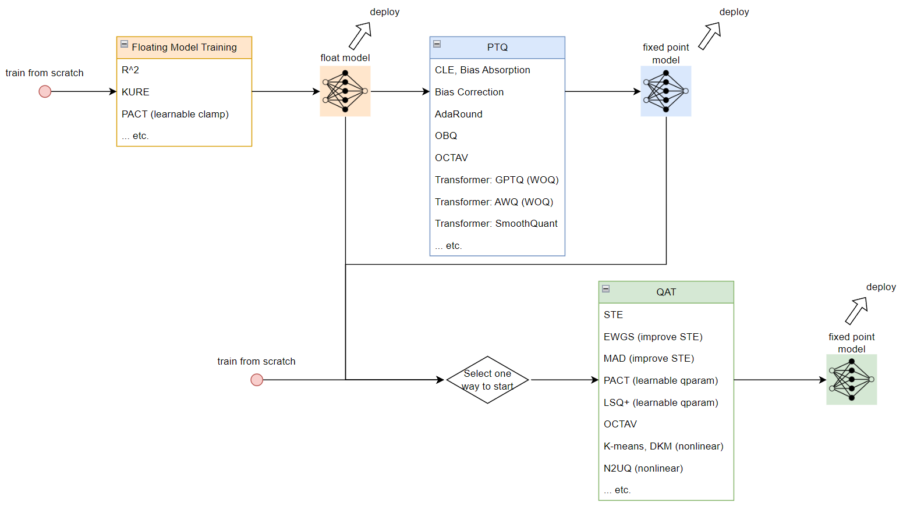

總結一下 (up to 2024-02-17) 目前學習的量化技術和流程圖 (本篇文章同時也記錄於 [blog](https://bobondemon.github.io/2024/02/17/%E9%87%8F%E5%8C%96%E6%8A%80%E8%A1%93%E8%B7%AF%E7%B7%9A/) 中)
 Post Training Quantization (PTQ) 稱事後量化. Quantization Aware Training (QAT) 表示訓練時考慮量化造成的損失來做訓練
為了得到 fixed point model 可以對事先訓練好的 float model 做 PTQ 或 QAT, 或是直接從 QAT 流程開始
同時 QAT 也可以用 PTQ 來初始化訓練. 如果要從 float model 開始做量化的話, 可以考慮在訓練 float model 時就對之後量化能更加友善的技術 (如 R^2, KURE, PACT)

接著對每個技術點盡量以最簡單的方式解說. 如果對量化還不是那麼熟悉, 建議參考一下文章後半段的"簡單回顧量化"

---
## 量化技術和流程

### Floating Model Training
這階段主要是讓訓練出來的 floating model 有利於之後量化的技術
- **R^2** [[paper](https://arxiv.org/abs/2303.08253)]: 認為 outliers 愈少, 愈有利於後面的量化或壓縮. 提出了 3 種 regularization losses.
- **KURE** [[paper](https://arxiv.org/abs/2002.07686)]: 使用 4th moments Kurtosis (KURE, KUrtosis REgularization) 來當 regularization 讓分佈接近 uniform, 同樣會有利於後面的量化.
- **PACT** [[paper](https://arxiv.org/abs/1805.06085)]: 使得 $l,u$ 這兩個 clipping 上下界能被學習, 限制數值範圍

### PTQ
PTQ 是針對 float model 做量化的技術, 不需要 training data, 通常只需要些許的 calibration data 即可, 有些技術仍會需要算 gradients, 而有些不用, 甚至連 calibration data 都不用.
一般來說 PTQ 效果會比 QAT 差, 但速度比 QAT 快多了, 同時針對 LLM 這種大模型 QAT 成本太高都只能使用 PTQ.
- **CLE, Bias Absorption, Bias Correction** [[paper](https://arxiv.org/abs/1906.04721)]: Qaulcomm DFQ (Data Free Quantization 技術), 詳見 [[blog](https://bobondemon.github.io/2023/11/24/Qualcomm-Data-Free-Quantization-%E8%A9%B3%E8%AE%80/)]
- **AdaRound** [[paper](https://arxiv.org/abs/2004.10568)]: weight 量化時的 rounding (四捨五入) 不一定是最佳的, 找出使用 floor 或 ceil 的最佳組合來取代全部都用 rounding 的方式
- **OBQ** (Optimal Brain Quantization) [[paper](https://arxiv.org/abs/2208.11580)]: 對於 weights 在 quantize 其中一個元素後還要調整其他元素, 使得 quantization 對 output activatyions 的 re-construction error 最小.
- **OCTAV** (Optimally Clipped Tensors And Vectors)[[paper](https://arxiv.org/abs/2206.06501)]: 找出最佳的 scale $S$ 使得 quantization MSE 最小, 詳見[[blog1](https://bobondemon.github.io/2023/10/28/Quantization-Error-Case-without-Clipping/), [blog2](https://bobondemon.github.io/2023/11/04/Quantization-Error-Case-with-Clipping/)]
- **Transformer GPTQ** (WOQ) [[paper](https://arxiv.org/abs/2210.17323)]: 基於 OBQ 的技術來針對 Transformer 做些改進和加速. Weight-Only-Quantization (WOQ)
- **Transformer AWQ** (WOQ) [[paper](https://arxiv.org/abs/2306.00978)]: 對 input activations 值域特別大的那些 channels 做 scaling 處理, 這樣能維持 LLM 的效果, 詳見筆記 [[blog](https://bobondemon.github.io/2023/12/28/AWQ-%E7%AD%86%E8%A8%98/)]. Weight-Only-Quantization (WOQ)
- **Transformer SmoothQuant** [[paper](https://arxiv.org/abs/2211.10438v5)]: 透過一些等價的轉換將 activations 的 scale 縮小並放大 weights 的 scale, 使得 activations 變的較容易 quant 而 weights 仍然容易 quant. 詳見筆記 [[blog](https://bobondemon.github.io/2023/12/28/SmoothQuant-%E7%AD%86%E8%A8%98/)]

### QAT
一般來說透過插入 fake-quant op (不清楚的話參見 "簡單回顧量化" 裡的說明) 使得在訓練時能感知到量化的誤差
- **STE** (Straight Through Estimator): 在做量化時 clip and round 這兩個運算不可微分, 為了能 back propagation 假裝沒有這兩個不可微分的 ops. 這是最常見和標準的 QAT 技巧.
- **EWGS** [[paper](https://arxiv.org/abs/2104.00903)]: 由於多個 floating 值會對應到同一個 quantized 值, 使得這些不同的 floating 值因為 STE 的原因都使用相同的 gradients, EWGS 改善了這點. 論文的 figure 1 圖示很清楚.
- **MAD** [[in OCTAV paper](https://arxiv.org/abs/2206.06501)]: 改善了 STE 對於 clipping op 的 under estimate 問題, 詳見論文裡的 figure 3 and appendix C.
- **PACT** [[paper](https://arxiv.org/abs/1805.06085)]: 使得 $l,u$ 這兩個 clipping 上下界能被學習, 限制數值範圍. 可以放在 QAT 過程中使用.
- **LSQ+** [[paper](https://arxiv.org/abs/2004.09576)]: 使得 $S,Z$ 這兩個 qparam 能被學習, 詳見筆記 [[blog](https://bobondemon.github.io/2022/12/04/Learning-Zero-Point-and-Scale-in-Quantization-Parameters/)]
- **OCTAV** (Optimally Clipped Tensors And Vectors)[[paper](https://arxiv.org/abs/2206.06501)]: 找出最佳的 scale $S$ 使得 quantization MSE 最小, 詳見[[blog1](https://bobondemon.github.io/2023/10/28/Quantization-Error-Case-without-Clipping/), [blog2](https://bobondemon.github.io/2023/11/04/Quantization-Error-Case-with-Clipping/)]. 除了上面 PTQ 做之外, 也可放在 QAT 過程中.
- **K-means** [[paper](https://arxiv.org/abs/1510.00149)], **DKM** [[paper](https://arxiv.org/abs/2108.12659)]: 屬於 nonlinear 量化, 利用 Kmeans 求出代表性的 codebook. DKM 為進一步改進的方法.
- **N2UQ** [[paper](https://arxiv.org/abs/2111.14826)]: 屬於 nonlinear 量化, 讓量化區間變成可學的 (固定的量化區間就是線性量化).

---
## 簡單回顧量化

量化就是將 float $X$ 用有限個點來表示, 如下圖

$\tilde{X}$ 的 4 個點對應到原來的 $X$ 可以看到是很不規則的, 或是說非線性
如果說這有限個點採用"線性"的對應方式, 則我們可以寫成下面式子對應關係:

$$
\begin{align}
\hat{X}=\text{clip}\left(\text{round}\left(X\over S\right)+Z,l,u\right) \\
\tilde{X}=S(\hat{X}-Z)
\end{align}
$$

$Z,S$ 分別稱為 zero point 和 scale, 而 $l,u$ 是 clipping 的 lower and upper bound.
所以量化參數 quantization parameters (用 qparam 簡稱) 就是

$$
\begin{align}
\text{qparam}=\\{Z,S,l,u\\}
\end{align}
$$

- Quantization Meam Square Error (MSE): $\mathbb{E}_X[(X-\tilde{X})^2]$
- Symmetric: $Z=0$ 時為對稱量化
- Dynamic: qparam 在 inference 時才去統計出
- Static: qparam 在 inference 之前就事先統計好
- Quantization Granuity [[SongHan slide](https://hanlab.mit.edu/courses/2023-fall-65940)]:   
  - per-tensor: 整個 weight or activation tensor 共用同一組 qparam
  - per-channel: 同一個 channel 共用同一組 qparam, 例如以 convolution kernel 來說, 同一個 output channel 的 weights 共用同一組 qparam
  - per-group: 常用在 LLM 的 Transformer, 通常以 64, 128 為一組共用 qparam

另外, 我們常說的 quant, de-quant, re-quant, fake-quant 可以用下圖來表示:
 

---
## Model Compression Toolkits
以下蒐集一些重要的模型壓縮 repositories, 因此不限於量化, 有些還包含 pruning, NAS, distillation, 或圖優化等
- Microsoft [Olive](https://github.com/microsoft/Olive?tab=readme-ov-file)
- Microsoft [NNI](https://github.com/microsoft/nni) (Neural Network Intelligence): with NAS, [Pruning](https://nni.readthedocs.io/en/v2.10/compression/pruner.html), [Quantization](https://nni.readthedocs.io/en/v2.10/compression/quantizer.html), Distilling
- OpenVino [Neural Network Compression Framework (NNCF)](https://github.com/openvinotoolkit/nncf)
- Intel [Neural Compressor](https://github.com/intel/neural-compressor): with NAS, [Pruning](https://intel.github.io/neural-compressor/latest/docs/source/pruning.html), [Quantization](https://intel.github.io/neural-compressor/latest/docs/source/quantization.html), [Distillation](https://intel.github.io/neural-compressor/latest/docs/source/distillation.html)
- Qualcomm [AIMET](https://github.com/quic/aimet): Quantization (DFQ and AdaRound, QAT), Model Compression (Spatial SVD, Channel pruning)
- NVidia [TensorRT-LLM](https://github.com/NVIDIA/TensorRT-LLM): optimize LLM (Transformer-based) models on NVidia GPU, using techniques such as Multi-query Attention ([MQA](https://arxiv.org/abs/1911.02150)), Group-query Attention([GQA](https://arxiv.org/abs/2307.09288)), Paged KV Cache, [SmoothQuant](https://arxiv.org/abs/2211.10438), [GPTQ](https://arxiv.org/abs/2210.17323), [AWQ](https://arxiv.org/abs/2306.00978), [Speculative decoding](https://arxiv.org/abs/2211.17192), …
- Sony [Model Compression Toolkit (MCT)](https://github.com/sony/model_optimization): Quantization with PTQ, GPTQ, QAT, Enhanced Post-Training Quantization ([EPTQ](https://github.com/sony/model_optimization?tab=readme-ov-file#enhanced-post-training-quantization-eptq)). [Structured Pruning](https://github.com/sony/model_optimization?tab=readme-ov-file#structured-pruning)

